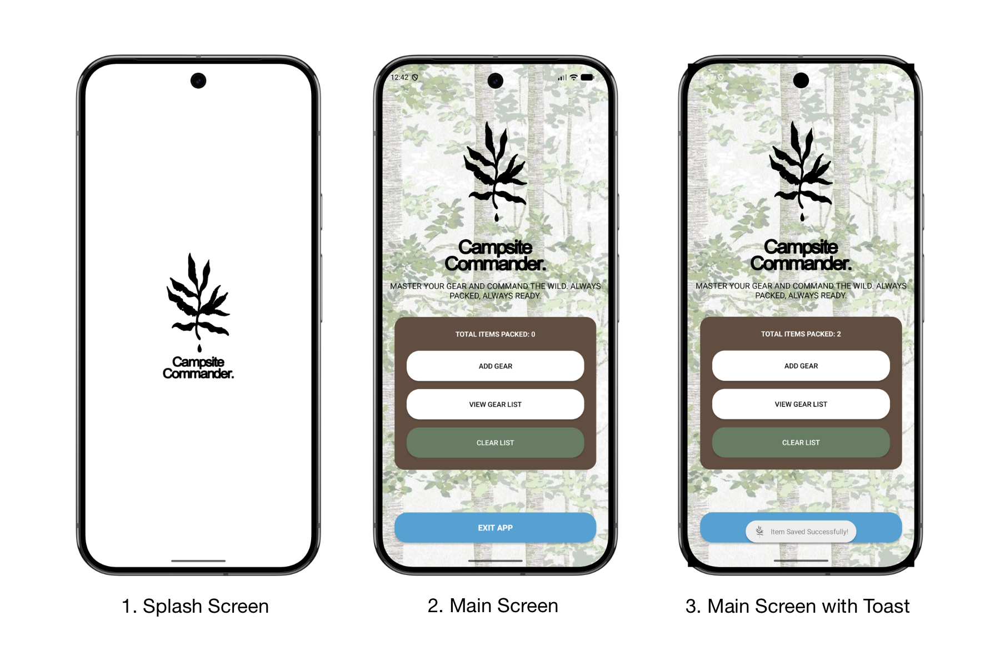
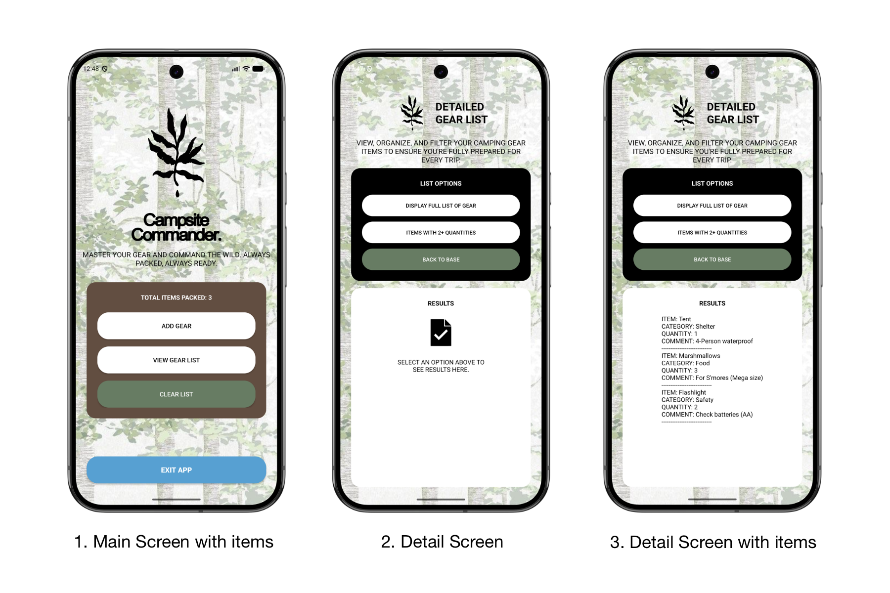

# Campsite Commander

**Author**: Lethabo Mohlala (ST10093005)

---
## Description
Campsite Commander is a complete inventory tool that helps camping enthusiasts organize and track their equipment properly. This application makes sure you're always ready, whether you're organizing a long trip or a weekend escape.

## Problem Statement
A wide range of equipment is frequently needed during camping excursions, including safety supplies, cooking equipment, and shelter. It is simple to forget necessary goods in the absence of an effective management system, which can result in stressful preparations or possibly hazardous circumstances in the wild. Keeping track of quantities and categories across several journeys is challenging with traditional paper lists since they are quickly misplaced or unorganized.

## Overview
A unified dashboard for cataloging your camping inventory is provided by the application. Its emphasis on user-friendliness enables users to swiftly add goods, classify them, and examine their gear list using intelligent filtering tools.

## Features
*   **Splash Screen**: A welcoming 3-second transition featuring the app's logo.
*   **Gear Inventory**: Add, view, and manage camping items with ease.
*   **Categorization**: Organize gear into categories like Shelter, Food, and Safety.
*   **Smart Filtering**: Quickly identify items with multiple quantities (2+).
*   **Persistent Storage**: Inventory is saved locally using SharedPreferences and GSON, ensuring data persists across app restarts.
*   **Camping Theme**: A custom-designed UI with an outdoor aesthetic, using a dedicated green and brown color palette.

## Screenshots
<h2 align="center">App Screenshots</h2>

  

  

  

## Design Considerations
*   **User Experience**: The "Add Gear" form is implemented as a dialog-styled activity to provide a non-intrusive pop-up experience.
*   **Visual Identity**: Custom drawables (`pine_icon1`, `text_icon1`) and a specific color scheme (`#2E7D32` Green, `#4E342E` Brown) were used to create a cohesive brand.
*   **Modern Standards**: Built using Android 15 (API 37) standards, leveraging ConstraintLayout for responsive design and Kotlin KTX for concise code.

## How to use the app
1.  **Launch**: Open the app and enjoy the splash transition.
2.  **Add Gear**: Tap "ADD GEAR" on the main screen. Enter the item details and select a category.
3.  **View List**: Tap "VIEW GEAR LIST" to see everything you've packed.
4.  **Filter**: Use the options in the list view to see the full list or filtered results.
5.  **Manage**: Use the "CLEAR LIST" button on the dashboard to reset your inventory if needed.
6.  **Exit**: Use the "EXIT APP" button to safely close the application.

## Installation
1.  Ensure you have **Android Studio** or newer installed.
2.  Clone the repository to your local machine.
3.  Open the project in Android Studio.
4.  Sync the project with Gradle files.
5.  Build and Run on an emulator or device running Android 7.0 (API 24) or higher.

## Tech Stack
*   **Language**: Kotlin
*   **UI Framework**: XML Layouts with Material Components
*   **Data Persistence**: SharedPreferences
*   **Serialization**: Google GSON

## Tools Used
*   **IDE**: Android Studio
*   **Build System**: Gradle (Kotlin DSL)
*   **Debugger/Profiler**: Android Studio Profiler
*   **Graphics**: Custom PNG drawables

## Version Control
*   **Git**: Managed via Git for branch tracking and history.
*   **Repository**: Hosted on GitHub.

## GitHub Actions
*   **CI/CD**: Configured for automated builds and basic linting checks on every pull request and push to the main branch.

## Testing
*   **Unit Tests**: JUnit 4 for data logic verification.
*   **UI Tests**: Android Instrumented tests using Espresso.

## Conclusion
Campsite Commander simplifies the most tedious part of camping: the packing list. By providing a reliable and visually pleasing way to manage gear, it helps adventurers focus on what matters—the great outdoors. Master your gear and command the wild!
